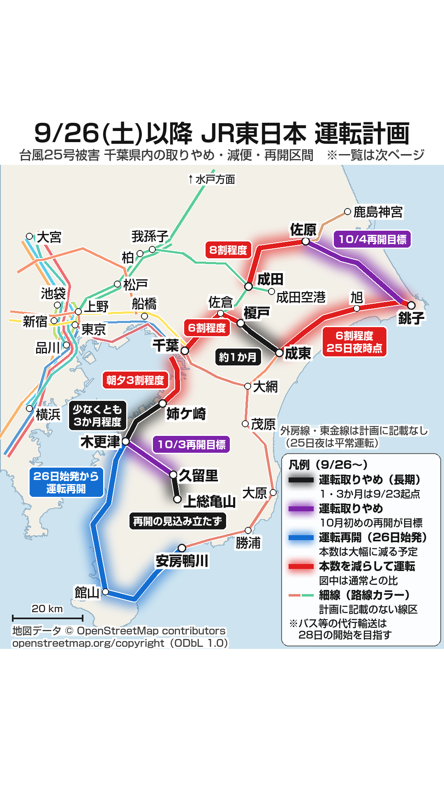
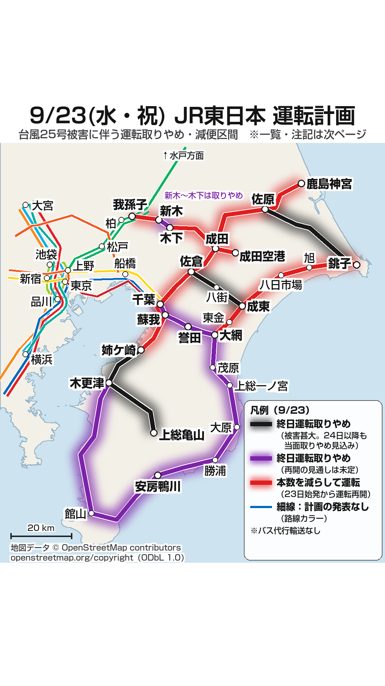
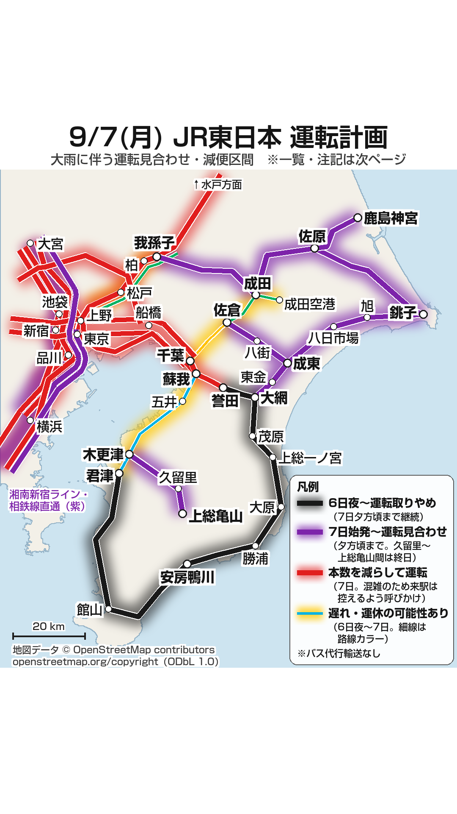

# JR東日本 運転計画マップ（台風時の計画運休・減便の路線図）

台風や大雨のたびに JR東日本が発表する運転計画は、区間ごとに「取りやめ」「見合わせ」「減便」が入り組んでおり、文字の一覧だけでは自分の乗る線がどれに当たるのか掴みにくいものです。そこで、Instagram のストーリーで共有することを前提に、路線図の形で状態を色分けした画像を2枚ずつ作っています。本リポジトリは、その画像と生成に用いたコードを収めたものです。

1枚目が地図、2枚目が一覧と注記です。地図で自分の路線の位置と状態を掴み、一覧で区間と時刻を確かめる組み立てにしています。いずれも 1080 × 1920 ピクセルで、Instagram のアプリ UI に隠れる上下（上端から270ピクセル、下端から340ピクセル）を空けてあります。

これまでに作った回は次の3回です。

| 対象日 | 事由 | 地図 | 一覧 |
| --- | --- | --- | --- |
| 2026年9月26日（土）以降 | 台風25号による千葉県内の被害（25日14時発表の計画） | `output/JR東日本_運転計画_2026-09-26_ストーリー用_1地図.png` | `output/JR東日本_運転計画_2026-09-26_ストーリー用_2一覧.png` |
| 2026年9月23日（水・祝） | 台風25号による千葉県内の被害（22日17時40分発表の計画） | `output/JR東日本_運転計画_2026-09-23_ストーリー用_1地図.png` | `output/JR東日本_運転計画_2026-09-23_ストーリー用_2一覧.png` |
| 2026年9月7日（月） | 台風24号と秋雨前線による大雨（6日発表の計画） | `output/JR東日本_運転計画_2026-09-07_ストーリー用_1地図.png` | `output/JR東日本_運転計画_2026-09-07_ストーリー用_2一覧.png` |

## 2026年9月26日以降（台風25号）

線路設備の点検で被害箇所が広範囲に確かめられ、JR東日本千葉事業本部は25日14時に「台風25号の影響による9月26日（土）以降の千葉県内各線区の運行計画について」を発表しました。地図・一覧はこの発表に、同社運行情報（25日21時30分時点）と同日の千葉事業本部長の記者会見の内容を加えて作っています。

| 1ページ目（地図） | 2ページ目（一覧・注記） |
| --- | --- |
|  |  |

| 色 | 状態 |
| --- | --- |
| 黒 | 26日以降も運転取りやめ。復旧まで1か月以上かかるか、再開の見込みが立っていない。図中の札は復旧までの見込み（期間は9月23日起点） |
| 紫 | 26日以降も運転取りやめ。10月3日・4日の運転再開を目指す |
| 青 | 26日始発から運転再開。運転本数の割合は示されていないが、発表文は運転する線区でも本数を大幅に減らす予定としている |
| 赤 | 本数を減らして運転。図中の札は通常に対するおおよその割合 |
| 細線 | 計画に記載のない線区（路線カラーを淡くして表示） |

総武本線 成東〜銚子の「6割程度」は、発表文に記載がなく、25日夜の運行情報によります。図中の札にもその時点を添えています。

## 2026年9月23日（台風25号）

台風25号の通過後、線路冠水・土砂流入・倒木が千葉県内の広範囲で見つかり、JR東日本千葉事業本部は22日17時40分に「台風25号の影響による9月23日（水・祝）の列車の運行について」を発表しました。地図・一覧はこの発表と、同社運行情報（22日18時31分現在）に基づきます。

| 1ページ目（地図） | 2ページ目（一覧・注記） |
| --- | --- |
|  |  |

| 色 | 状態 |
| --- | --- |
| 黒 | 23日終日運転取りやめ。被害が甚大で、24日以降も当面の間取りやめ |
| 紫 | 23日終日運転取りやめ。再開の見通しは未定（外房線 千葉〜誉田は24日始発から再開見込み） |
| 赤 | 23日始発から運転再開、本数を減らして運転 |
| 細線 | 23日の運転計画の発表がない路線（路線カラー） |

## 2026年9月7日（台風24号）

台風24号と秋雨前線による大雨を前に、JR東日本は6日に7日の運転計画を発表しました。地図・一覧は同社運行情報の6日22時17分現在の内容に基づきます。

| 1ページ目（地図） | 2ページ目（一覧・注記） |
| --- | --- |
|  |  |

| 色 | 状態 |
| --- | --- |
| 黒 | 6日夜から運転取りやめ（7日夕方頃まで継続） |
| 紫 | 7日始発から運転見合わせ |
| 赤 | 本数を減らして運転（7日） |
| 黄 | 予告のみ（6日夜〜7日、遅れ・運休の可能性） |

## 実行手順

Python 3.13 で作成しました（開発環境は 3.13.5 / Windows 11）。必要なライブラリは3つです。

```
pip install pillow shapely numpy
```

動作を確かめた版は Pillow 11.2.1、shapely 2.1.1、numpy 2.4.6 です。

画像の生成は、リポジトリ直下から次を実行します。`data/land.json` と `data/st.json` はリポジトリに同梱してあるため、取得の手順を踏まずにそのまま描画できます。回ごとにスクリプトを分けてあり、ファイル名の日付が対象日です。

```
python scripts/render_map_20260926.py     # 9/26 以降の地図を output/ に書き出す
python scripts/render_list_20260926.py    # 9/26 以降の一覧を output/ に書き出す
python scripts/render_map_20260923.py     # 9/23 の地図
python scripts/render_list_20260923.py    # 9/23 の一覧
python scripts/render_map_20260907.py     # 9/7 の地図
python scripts/render_list_20260907.py    # 9/7 の一覧
```

引数に書き出し先のパスを渡せば、そちらへ保存します。

基礎データを取り直す場合は次を実行します。いずれも OpenStreetMap を Overpass API 経由で取得します。海岸線は数万点になるため、取得と組み立てに数分かかることがあります。`land` または `stations` を引数に付けると、他方のみを取得します。

```
python scripts/fetch_data.py
```

9/23 の地図で新たに要した3駅（姉ケ崎・布佐・新木）は、Overpass API が応答しなかったため `scripts/fetch_stations_nominatim.py` で Nominatim（OpenStreetMap のジオコーダ）から取得し、`data/st.json` に加えてあります。9/26 以降の地図で要した榎戸も、同じスクリプトで取得しました。

### フォントについて

作図にはモリサワ 新ゴ Pro を用いました。ライセンス上再配布できないため、リポジトリには含めていません。`scripts/fontsel.py` が環境にあるものを次の順で選びます。

1. モリサワ 新ゴ Pro（`%LOCALAPPDATA%\Microsoft\Windows\Fonts\MorisawaFonts\A-OTF-ShinGoPro-*.otf`）
2. BIZ UDゴシック（`C:\Windows\Fonts\BIZ-UDGothicB.ttc` / `BIZ-UDGothicR.ttc`。Windows 10・11 に同梱）
3. Noto Sans JP（可変フォント・静的ウェイトのいずれでも可。リポジトリ直下に `fonts/` を作って置くこともできます）

新ゴは4ウェイト（DeBold・Bold・Medium・Regular）を使い分けていますが、代替のフォントは太字と細字の2段しか持ちません。DeBold と Bold を太字に、Medium と Regular を細字に割り当てます。字面と字送りが変わるため、公開している画像とは版面が一致しません。どのフォントで描いたかは実行時に標準出力へ表示されます。

## データの出所と権利表示

- **陸地・駅の座標** … OpenStreetMap を Overpass API および Nominatim 経由で取得しました。© OpenStreetMap contributors、[ODbL 1.0](https://opendatacommons.org/licenses/odbl/1-0/) の下で提供されています（[OpenStreetMap の権利表示](https://www.openstreetmap.org/copyright)）。陸地は `natural=coastline` のウェイを繋いで組み立て、駅は `railway=station` のノードを駅名で抽出したものです。
- **路線カラー** … Wikipedia「日本の鉄道ラインカラー一覧」（[CC BY-SA 4.0](https://creativecommons.org/licenses/by-sa/4.0/deed.ja)）から2026年9月6日に取得した色コードによります。水郡線と水戸線は同表に記載がないため、灰色としました。
- **運行情報** … 9/26 以降の分は JR東日本千葉事業本部「台風25号の影響による9月26日（土）以降の千葉県内各線区の運行計画について」（2026年9月25日14時発表）、JR東日本 運行情報（同日21時30分時点）、同本部長の記者会見（同日。ANNnewsCH のノーカット配信 <https://www.youtube.com/watch?v=I4PnaZsRtO4> による）、Yahoo!路線情報（同日21時31分時点。東金線の運行状況）に基づきます。9/23 分は JR東日本千葉事業本部「台風25号の影響による9月23日（水・祝）の列車の運行について」（2026年9月22日17時40分発表）と JR東日本 運行情報（同日18時31分現在）、9/7 分は JR東日本 運行情報の2026年9月6日22時17分現在の内容に基づきます。同社ページの文章・画像は転載しておらず、区間と状態を読み取って独自に作図したものです。実際に利用される際は、必ず同社の最新の発表をご確認ください。

各データの利用条件と加工の内容は [data/README.md](data/README.md) に記しました。`data/` のファイルまたは `output/` の画像を再利用される場合は、そちらをご確認ください。

## 既知の制約

- **河川・湖沼が陸地になっています。** 陸地は海岸線（`natural=coastline`）から組み立てており、内陸の水面は区別されません。霞ヶ浦や利根川は表現されません。一方、港湾の運河や掘込港は海岸線に含まれるため、東京湾岸や鹿島港では陸地の中に海の色が入り込みます。
- **駅間は直線で結んでいます。** 線路の実際の線形は反映していません。並走区間は一定の間隔でオフセットして描き分けていますが、位置関係は模式的なものです。
- **Instagram のストーリーに合わせて上下を空けています。** 上端から270ピクセル、下端から340ピクセルをセーフゾーンとして空白にしてあります。アプリの UI に隠れる領域を避けるためで、画像の中央寄りに内容が集まっています。

## ライセンス

`scripts/` のコードと `output/` の画像について、作成者が持つ権利の範囲で MIT ライセンスを適用します（著作権者は [LICENSE](LICENSE) に掲げたとおりです）。

これは第三者の権利に影響しません。`data/` のファイルは MIT の対象外で、© OpenStreetMap contributors、ODbL 1.0 の下にあります。1ページ目の地図画像は `data/land.json`・`data/st.json` から作られた ODbL でいう Produced Work に当たるため、図中に © OpenStreetMap contributors の表示とライセンスの案内先を入れてあります。MIT で利用できる場合であっても、この表示は残してください。条件は [data/README.md](data/README.md) によります。2ページ目の一覧画像は、これらのデータを用いていません。
